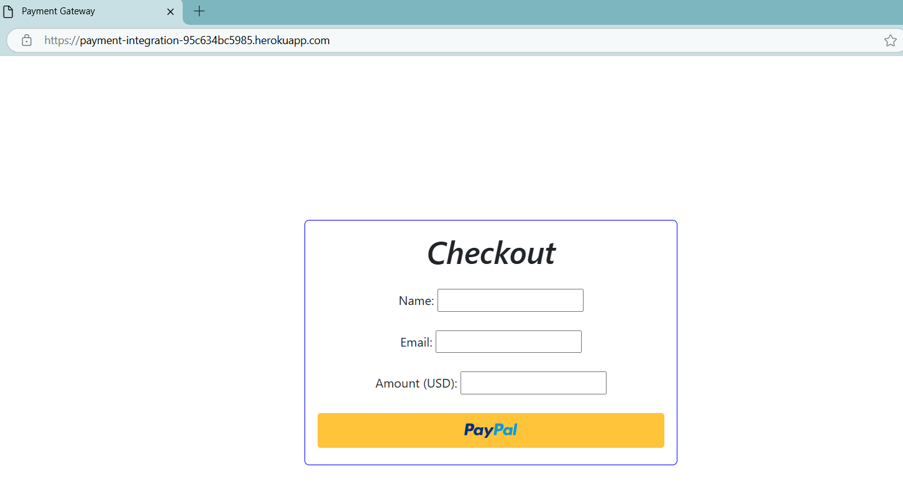

# Project name
PaymentIntegration

# Project description

*Importance of the project*

PaymentIntegration addresses the need for seamless and reliable payment processing in modern web applications. By implementing a backend payment processing system, it eliminates the complexities of integrating payment solutions while enhancing user experience through effective error handling and clear status messages. The project demonstrates the power of automation in software development through a CI/CD pipeline, enabling rapid deployment and maintaining code quality. Its impact lies in providing a blueprint for efficient payment integration, empowering developers to deliver secure, user-friendly payment solutions with minimal frictions.

*What the project does*

PaymentIntegration is a backend payment system developed using the Django REST Framework. It integrates PayPal's REST API indirectly through their JavaScript SDK and the paypalrestsdk module for secure payment transactions. The system offers a RESTful API with versioning and status message, ensuring clarity and ease of use.

**Backend Setup**
+	*Development*: Built with Django REST Framework to create RESTful APls for payment processing.
+	Payment Integration: Utilizes PayPal's REST API through their JavaScript SDK and paypalrestsk for managing transactions.
+	*Error Handling*: Communicates transaction outcomes effectively with detailed status messages to enhance user experience.
CI/CD Pipeline on GitHub
+	*Test*: Uses Django's testing framework to perform status checks and the PayPal sandbox environment for verifying payment functionality.
+	*Build*: Ensures the application builds correctly and all dependencies are installed.
+	*Deploy*: Deploys the application to Heroku for easy accessibility.

**Deliverables**

1. *RESTful API*: A fully functional API for processing payments, featuring:
+	Versioning to manage updates efficiently.
+	No user authentication, focusing solely on payment processing.
+	Clear status messages for improved user interaction.

1. *CI/CD Pipeline*: A GitHub Actions pipeline automating:
+	Testing for transaction verification and API functionality.
+	Deployment to Heroku, ensuring a streamlined release process.

1. *Documentation*: Comprehensive guidelines covering:
+	Running the service locally.
+	Understanding and running tests.
+	Deploying the application using the CI/CD pipeline.

# Installation section
*Tell other users how to install your project locally*

Outline the steps necessary to build and run your application with venv:

1. Open the Command Prompt
1. Create a Virtual Environment:
    + in Command Prompt (powershell)
    + create a folder for new virtual env: mkdir Virtual_env
    + cd Virtual_env
    + create virtual env: `virtualenv PaymentVenv --python=python3.11`
    + you will see Scripts in PaymentVenv
    + change to Command Prompt (admin) 
    
1. Activate the Virtual Environment:
    + On Windows (Command Prompt):
        + cd to path to Scripts "C:\Users\path\to\PaymentVenv\Scripts"
        + `activate.bat`
   
1. Download Python 3.11 to run the program @ https://www.python.org/downloads/
1. Run the Python Installer
1. Check the Box for "Add Python to PATH"
In cmd:
1. Verify pip installation: `pip --version`

*Note: Django Secret Key is in the .env*
You will need to set up your custom Secret Key before running the website
1. Clone this repository
1. Create a `.env` file in the project's root directory with the following content:
    + DJANGO_SECRET_KEY=mysecretkeygoeshere
1. Install Packages:
    + pip install [package_name]
    
    OR
    + python -m pip install -r requirements.txt

1. Create business PayPal account [here](https://developer.paypal.com/).
1. Ensure you are in sandbox mode not live on the PayPal website [here](https://developer.paypal.com/dashboard/applications/sandbox).
1. Go to Apps & Credentials [here](https://developer.paypal.com/dashboard/applications/sandbox).
1. Create a REST API application, PaymentIntegration, for example.
1. Save PaymentIntegration's client ID & client secret as PAYPAL_CLIENT_ID, PAYPAL_CLIENT_SECRET (without quotation marks) to a .env file in the root directory according to [this](https://developer.paypal.com/studio/checkout/standard/getstarted?backend=python#setup-dev-environment) resource.

1. Go to Sandbox test accounts [here](https://developer.paypal.com/dashboard/accounts)
1. Create business & personal sandbox accounts.
1. Save their emails & passwords in .env because you will enter their login details later.

1. Visit the [sandbox](https://sandbox.paypal.com).
1. Log into sandbox with the business sandbox account.

# Usage section
*Instruct others on how to use your project after they’ve installed it*

In the Command Prompt:
+ Change directory to project root directory

+ Go to the GitHub Actions tab in the [repository](https://github.com/KC-software-en/PaymentIntegration/actions) to view the workflow running. Expand the jobs that were ran. The Run Tests job will show that the test for the status check of the PaymentIntegration homepage was successful.

1. Run the command to start the local server: `python manage.py runserver`
1. Go to the [homepage](http://127.0.0.1:8000/payment/).
1. Enter the name, email and amount you want to pay.
1. Click on the PayPal button. If a blank pop-up opens, move it away from the PayPal payment gateway that opens directly behind it.

*You can test that the REST API works with sandbox credentials.*
1. Enter the enter personal sandbox account's email and password in the PayPal pop-up then complete the payment.

*A successfull test shows the transactions on the [sandbox](https://sandbox.paypal.com) site.*
1. Login to sandbox with the personal sandbox account to see the transactions.
1. Login to sandbox with the business sandbox account to see the transactions.

1. In CMD, stop the server: `CTRL + C`
1. Deactivate the Virtual Environment:
    + `deactivate`

*Include screenshots of your project in action*

# Credits
*Highlights and links to the authors of your project if the project has been created by more than one person*

@KC-software-en https://github.com/KC-software-en

# Add a URL to your GitHub repository
https://github.com/KC-software-en/PaymentIntegration

# Add a url to the PaymentIntegration website
